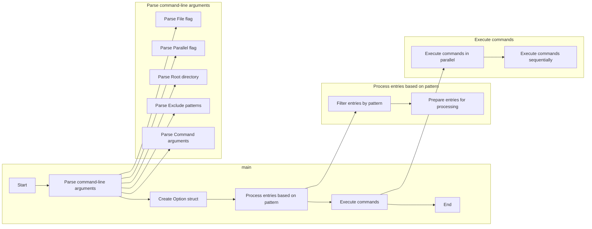
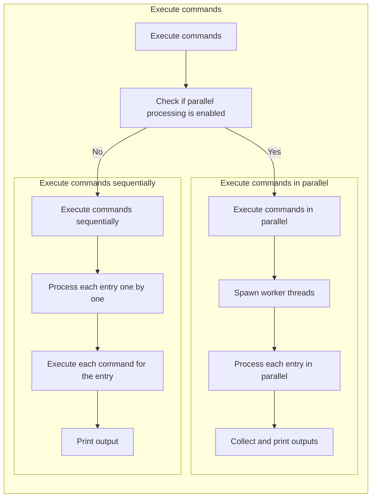

### 1. Main Execution Flow

### 2. Command Processing Flow

### Explanation

1. **Main Execution Flow**:

    - The main function starts by parsing command-line arguments.
    - It then creates an `Option` struct based on the parsed arguments.
    - The entries are processed based on the specified pattern.
    - Commands are executed either in parallel or sequentially.
    - The process ends after all commands are executed.

2. **Command Processing Flow**:
    - The command execution starts by checking if parallel processing is
      enabled.
    - If parallel processing is enabled, worker threads are spawned to process
      each entry in parallel.
    - If parallel processing is disabled, each entry is processed sequentially.
    - Outputs are collected and printed in both cases.
